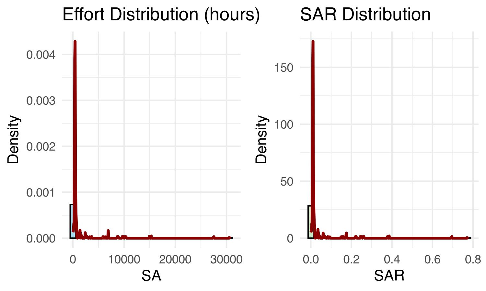
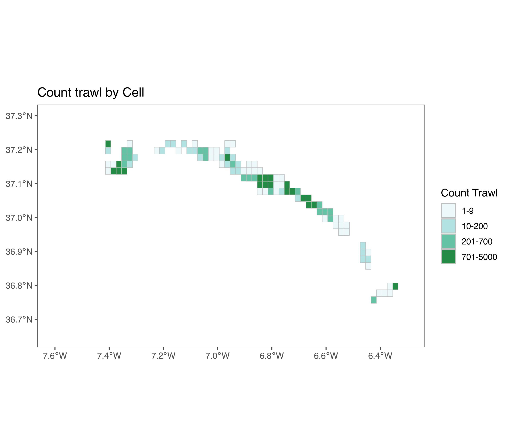

\newpage


# Main functions 

Here is a brief overview of each function in the `SARtisanal` package [@Mardones2024]:

- `read_artdata()`: Multiple .txt files from a specified folder are read and combined into a single data frame, with each row tagged by its source file name in a new column. This function allows custom separators, headers, and returns a unified data frame for easy analysis across multiple files.

- `read_artdata_2()`: Reads and combines multiple .csv files, supporting custom separators and headers. It also includes a source file column to retain the origin of each row, which is ideal for analyzing data spread across several .csv files with non-standard delimiters.

- `remo_dup()`: remove duplicates in databases.

- `distart()`: Computes distances between consecutive points in a dataset, assisting in estimating fishing vessel movement and potential coverage.

- `SAbarrida()`: This function calculates the Swept Area (*SA*) by multiplying the distance traveled by the fishing gear and its width. It returns a vector of the calculated swept areas based on the input vectors for distance and gear width.

- `process_art_effort()`: Processes artisanal fishing effort data by assigning coordinates to grid cells, calculating the mean swept area (*SA*) for each cell, and returning a data frame with the spatial distribution of fishing effort. Also, calculate the Swept Area Ratio (*SAR*) by dividing fishing effort data by cell area, indicating the impact intensity across different areas.

- `count_art_trawl()` Processes artisanal fishing effort data by creating a spatial grid and counting the number of vessel passages through each grid cell. It filters the data, joint into the grid, and performs a spatial join to calculate the number of times vessels pass through each cell, returning a spatial data frame with the results.

Each function supports artisanal fishery data analysis, focusing on measuring and visualizing fishing impacts using spatial grid-based calculations.

# Initial steps

Load `SARtisanal` library from github pages using `devtools`


``` r
library(devtools)
install_github("MauroMardones/SARtisanal")
```


``` r
library(SARtisanal)
```

and load another important packages;


``` r
packages <- c("tidyverse", "ggridges", "here", "lubridate", "readr", "ggthemes", 
              "kableExtra", "gtsummary", "egg", "sf", "sp", "maps", "pheatmap", "spdep", "skimr")

invisible(lapply(packages, library, character.only = TRUE))
```
Example to load own `.txt` data;


``` r
archivos <- c("Draga_01.txt", 
              "Draga_02.txt", 
              "Draga_03.txt")
carpeta <- "your/path"

# Read and join all files
if (all(file.exists(file.path(carpeta, archivos)))) {
  datos_combinados <- read_artdata(archivos, carpeta, sep = ",")
  print(datos_combinados)
} else {
  warning("One or more files are not found in the specified folder.")
}
```
or loading `.csv`files;


``` r
archivos_csv <- c("archivo1.csv", 
                  "archivo2.csv", 
                  "archivo3.csv")
carpeta <- "your/path"

# Read and join all files
if (all(file.exists(file.path(carpeta, archivos_csv)))) {
   datos_csv <- read_artdata_csv_2(archivos_csv, carpeta, sep = ",", header = TRUE)
   print(datos_csv)
} else {
 warning("One or more .csv files are not found in the specified folder.")
}
```

1. Load data example


`Sartisanal` package has example data to use like guide. This data is using General Pack Radio Service/Global Mobile System (GPRS/GMS) technology data from a fleet of nearly 100 vessels in the artisanal fishery of wedge clam in the Gulf of Cadiz. 


``` r
data("artdata")
```

what kind of information has the example data? This could be a base data to upload your own data with a similar format and similar valiarbles (columns) to reporduce this analysis. Each vraiable is explained in documentation of `SARtisanal`.


``` r
glimpse(artdata)
```

```
## Rows: 43,430
## Columns: 21
## $ FK_ERES     <int> 601, 601, 601, 601, 601, 601, 601, 601, 601, 601, 601, 601…
## $ FECHA       <chr> "29/01/2009", "29/01/2009", "29/01/2009", "29/01/2009", "3…
## $ DIA         <chr> "THURSDAY", "THURSDAY", "THURSDAY", "THURSDAY", "FRIDAY", …
## $ HORA        <chr> "13:31:17", "13:39:15", "13:42:13", "13:51:13", "11:01:20"…
## $ FK_BUQUE    <int> 9883, 9883, 9883, 9883, 9883, 9883, 9883, 9883, 9883, 9883…
## $ MATRICULA   <chr> "SE-1-768", "SE-1-768", "SE-1-768", "SE-1-768", "SE-1-768"…
## $ PUERTO      <chr> "SANLUCAR", "SANLUCAR", "SANLUCAR", "SANLUCAR", "SANLUCAR"…
## $ FK_TIPO_F   <int> 3, 3, 3, 3, 3, 3, 3, 3, 3, 3, 3, 3, 3, 3, 3, 3, 3, 3, 3, 3…
## $ F_LOCALIZA  <chr> "29-JAN-09", "29-JAN-09", "29-JAN-09", "29-JAN-09", "30-JA…
## $ N_LONGITUD  <dbl> -6.338148, -6.338153, -6.338127, -6.338148, -6.451208, -6.…
## $ N_LATITUD   <dbl> 36.80516, 36.80516, 36.80516, 36.80515, 36.87560, 36.79270…
## $ N_X         <dbl> 202279.3, 202278.8, 202281.2, 202279.2, 192471.5, 200249.9…
## $ N_Y         <dbl> 4078662, 4078661, 4078662, 4078661, 4086838, 4077348, 4078…
## $ N_VELOCIDAD <dbl> 0.10799, 0.11879, 0.14039, 0.10799, 1.83423, 0.76350, 0.25…
## $ N_RUMBO     <dbl> 22.1000, 66.2240, 87.8480, 114.8000, 12.9820, 260.6700, 31…
## $ N_SATELITES <int> 5, 7, 8, 8, 9, 7, 8, 8, 8, 8, 8, 9, 9, 9, 9, 9, 10, 10, 9,…
## $ N_EN_PUERTO <int> 0, 1, 1, 1, 0, 0, 1, 1, 1, 1, 1, 0, 0, 0, 0, 0, 0, 0, 0, 0…
## $ L_BACKUP    <int> 0, 0, 0, 0, 0, 0, 0, 0, 0, 0, 0, 0, 0, 0, 0, 0, 0, 0, 0, 0…
## $ FK_ACTIVI   <int> 3, 1, 1, 1, 4, 3, 1, 1, 1, 1, 1, 3, 3, 4, 4, 4, 4, 3, 3, 3…
## $ FK_ESTADO   <int> 5, 5, 5, 5, 3, 3, 3, 3, 3, 3, 3, 3, 3, 3, 3, 3, 3, 3, 3, 3…
## $ FK_MODAL    <int> 0, 0, 0, 0, 3, 0, 0, 0, 0, 0, 0, 0, 0, 3, 3, 3, 3, 0, 0, 0…
```
A common error with this kind of information, its deal witgh duplicated data. To remove, we use `remo_dup` function.

2. Remove duplicate and test differences


``` r
dim(artdata)
```

```
## [1] 43430    21
```

``` r
artdata2 <- remo_dup(artdata)
dim(artdata2)
```

```
## [1] 41663    21
```

3. Calculate distance

Now, first analytical process its calculate the distance between trawls. We calculate distance row by row, assuming a conntuniun register of fishery activity. To do that, we use the `distart`;


``` r
artdata_con_distancias <- distart(
   data = artdata2,
   lat_col = "N_LATITUD",
   lon_col = "N_LONGITUD",
   fecha_col = "FECHA",
   hora_col = "HORA",
   barco_col = "FK_BUQUE"
)
```

Visualizing new data with `skim`;


``` r
skimr::skim(artdata2)
```


Table: Data summary

|                         |         |
|:------------------------|:--------|
|Name                     |artdata2 |
|Number of rows           |41663    |
|Number of columns        |21       |
|_______________________  |         |
|Column type frequency:   |         |
|character                |6        |
|numeric                  |15       |
|________________________ |         |
|Group variables          |None     |


**Variable type: character**

|skim_variable | n_missing| complete_rate| min| max| empty| n_unique| whitespace|
|:-------------|---------:|-------------:|---:|---:|-----:|--------:|----------:|
|FECHA         |         0|             1|  10|  10|     0|       57|          0|
|DIA           |         0|             1|   6|   9|     0|        7|          0|
|HORA          |         0|             1|   8|   8|     0|    24313|          0|
|MATRICULA     |         0|             1|   8|  10|     0|       84|          0|
|PUERTO        |         0|             1|   4|  13|     0|        7|          0|
|F_LOCALIZA    |         0|             1|   9|   9|     0|       57|          0|


**Variable type: numeric**

|skim_variable | n_missing| complete_rate|       mean|       sd|         p0|        p25|        p50|        p75|       p100|hist  |
|:-------------|---------:|-------------:|----------:|--------:|----------:|----------:|----------:|----------:|----------:|:-----|
|FK_ERES       |         0|             1|     726.04|   250.68|     501.00|     581.00|     630.00|     681.00|    1310.00|▇▁▁▁▂ |
|FK_BUQUE      |         0|             1|   24574.71|  2951.43|    9883.00|   24204.00|   25171.00|   25978.00|   27201.00|▁▁▁▂▇ |
|FK_TIPO_F     |         0|             1|       3.00|     0.00|       3.00|       3.00|       3.00|       3.00|       3.00|▁▁▇▁▁ |
|N_LONGITUD    |         0|             1|      -6.84|     0.26|      -7.41|      -6.87|      -6.82|      -6.69|      -6.34|▃▁▇▆▂ |
|N_LATITUD     |         0|             1|      37.09|     0.10|      36.75|      37.06|      37.11|      37.13|      37.23|▁▁▁▇▃ |
|N_X           |         0|             1|  158833.07| 23071.89|  107650.37|  155969.19|  160927.12|  171739.75|  202389.14|▃▁▇▆▂ |
|N_Y           |         0|             1| 4111560.72| 11492.26| 4072521.42| 4108525.81| 4114135.27| 4115954.07| 4128613.73|▁▁▂▇▃ |
|N_VELOCIDAD   |         0|             1|       1.66|     0.89|       0.10|       1.08|       1.92|       2.22|       5.00|▆▇▇▁▁ |
|N_RUMBO       |         0|             1|     180.52|   101.10|       0.00|     102.62|     157.18|     284.67|     359.99|▅▇▅▃▆ |
|N_SATELITES   |         0|             1|       9.05|     1.14|       4.00|       8.00|       9.00|      10.00|      12.00|▁▁▂▇▁ |
|N_EN_PUERTO   |         0|             1|       0.11|     0.32|       0.00|       0.00|       0.00|       0.00|       1.00|▇▁▁▁▁ |
|L_BACKUP      |         0|             1|       0.01|     0.10|       0.00|       0.00|       0.00|       0.00|       1.00|▇▁▁▁▁ |
|FK_ACTIVI     |         0|             1|       3.39|     0.89|       1.00|       3.00|       4.00|       4.00|       4.00|▁▁▁▅▇ |
|FK_ESTADO     |         0|             1|       4.83|     0.67|       1.00|       5.00|       5.00|       5.00|       5.00|▁▁▁▁▇ |
|FK_MODAL      |         0|             1|       1.79|     1.51|       0.00|       0.00|       3.00|       3.00|       4.00|▆▁▁▇▁ |

# Calculate Distance between trawls.

First Swept Area using distance by width trawl resulting in `SA` variable in m^2, where `SA` will be the distance traveled by the drag and the opening in meters of the dredge, that is;

$$
SA = Distance \times width \ trawl
$$
We use different width trawl. To do this we use `SAbarrida` function; 


``` r
artdataSA <- artdata_con_distancias %>% 
  mutate(
    SA = SAbarrida(distancia, ancho = 2.5),  
    SA2 = SAbarrida(distancia, ancho = 3)  
  )
summary(artdataSA$SA)
```

```
##     Min.  1st Qu.   Median     Mean  3rd Qu.     Max.     NA's 
##      0.0    174.8    354.7    696.4    454.0 137110.5      709
```

``` r
summary(artdataSA$SA2)
```

```
##     Min.  1st Qu.   Median     Mean  3rd Qu.     Max.     NA's 
##      0.0    209.8    425.6    835.6    544.8 164532.6      709
```


# Processing and Visualizing Fishing Effort Data

The `procces_art_effort` function have the next component of analysis;


1. Filter and Validate Data: The code begins by filtering `artdataSA` to ensure all entries contain valid values for longitude (`N_LONGITUD`), latitude (`N_LATITUD`), and swept area (SA). This step removes entries with any missing values in these columns.

2. Define Study Area Boundaries: It calculates the minimum and maximum values for longitude and latitude to define the geographical boundaries of the study area.

3. Generate Spatial Grid: Using these boundaries, a spatial grid is created where each cell represents a 0.02^0 x 0.02^0 area. Each cell is uniquely identified by a `cellid`.

4. Spatial Data Transformation and Aggregation: The data is converted to a spatial format (`sf`) to align with the grid. Each data point is assigned to its respective grid cell, where the mean SA for each cell is calculated, representing the average fishing effort in that location.

5. Handle Missing Data: The code checks for cells without SA data and assigns `NA` to indicate missing values.

the, with `artdataSA`, we use `procces_art_effort` function;


``` r
processed_data <- process_art_effort(artdataSA, 
                                     lon_col = "N_LONGITUD", 
                                     lat_col = "N_LATITUD", 
                                     sa_col = "SA", 
                                     cell_size = 0.02)
```

Now, a histogram with an overlaid density plot is created to visualize the distribution of mean SA values across grid cells. This provides a graphical representation of fishing effort concentration, highlighting areas with high or low activity.

This approach provides a structured analysis of fishing effort across spatial grid cells, supporting further spatial and statistical analyses.


``` r
sa <- ggplot(processed_data, 
             aes(x = promedio_SA)) +
  geom_histogram(aes(y = ..density..), 
                 bins = 30, 
                 fill = "skyblue", 
                 color = "black", 
                 alpha = 0.7) +
  geom_density(color = "darkred", size = 1) +
  labs(title = "Effort Distribution (hours)",
       x = "SA", y = "Density") +
  theme_minimal()

sar <- ggplot(processed_data, aes(x = SAR)) +
  geom_histogram(aes(y = ..density..),
                 bins = 30, 
                 fill = "#bae4b3", 
                 color = "black", 
                 alpha = 0.7) +
  geom_density(color = "darkred", size = 1) +
  labs(title = "SAR Distribution", x = "SAR", y = "Density") +
  theme_minimal()

ggarrange(sa, sar,
          ncol =2)
```



# Calculating Swept Area Ratio (SAR)

According to @Church2016, the calculation of the Swept Area Ratio (SAR) `SA` is the swept area (mts/2), `CA` is the area of the cell and `SAR` is the proportion of the swept area (equivalent to the number of times the cell was swept).

where;

$$
SAR = \frac{SA}{CA}
$$

Grid Cell Area Calculation: This section begins by ensuring that each cellid in Grid2 is an integer, facilitating compatibility for data joins. It also calculates the area for each grid cell (`area_celda`) using spatial geometry and converts this measurement to a numeric format.

Prepare Data and Join Grid Attributes: In the `processed_data` dataset, cellid values are also converted to integers. The data is then joined with Grid2 on cellid, allowing each record to incorporate the area of the corresponding grid cell (`area_celda`).

Calculate Swept Area Ratio (`SAR`): Using the formula for SAR, which is the mean swept area (promedio_SA) divided by the cell area (`area_celda`), the swept area ratio is calculated and multiplied by 100 to express it as a percentage.

This code provides a quantitative measure (`SAR`) that indicates the fishing effort density within each grid cell, enabling the assessment of spatial impacts of fishery fleets.


Finally, we have a map with spatial distribution of `SAR`


``` r
p_sar <- ggplot() +
  geom_sf(data = processed_data %>%
            mutate(
           SAR_niveles = cut(SAR,
                            breaks = c(0, 0.05, 0.1, 0.15, 0.2, 0.25, 0.3, 0.35, 0.4, 0.45, 0.5, Inf),
                            labels = c("0-0.05", "0.05-0.1", "0.1-0.15", "0.15-0.2", "0.2-0.25", 
                                       "0.25-0.3", "0.3-0.35", "0.35-0.4", "0.4-0.45", "0.45-0.5", ">0.5"),
                             include.lowest = TRUE)) %>% 
    drop_na(SAR_niveles), 
          aes(fill = SAR_niveles), color = "grey") +
 
  scale_fill_brewer(
                    name = "SAR") +
  labs(title = "Distribution SAR") +
  coord_sf(xlim = c(-7.6, -6.3), 
           ylim = c(36.65, 37.3)) + 
  theme_few() +
  theme(legend.position = "right")  

p_sar
```


# Count Vessel trawl 


``` r
trawl_count <- count_art_trawl(artdataSA, 
                               lon_col = "N_LONGITUD", 
                               lat_col = "N_LATITUD",
                               cell_size = 0.02)
```
Map


``` r
p_count <- ggplot() +
  geom_sf(data = trawl_count %>%
            mutate(
           count_passages_leves = cut(count_passages,
                           breaks <- c(0, 10, 200, 700, 5000),
                           labels <- c("1-9", "10-200", "201-700", "701-5000"),
                             include.lowest = TRUE)) %>% 
    drop_na(count_passages_leves), 
          aes(fill = count_passages_leves), color = "grey") +
 
  scale_fill_brewer(palette = 2,
                    name = "Count Trawl") +
  labs(title = "Count trawl by Cell") +
  coord_sf(xlim = c(-7.6, -6.3), 
           ylim = c(36.65, 37.3)) + 
  theme_few() +
  theme(legend.position = "right")  

p_count
```




# Another things

Just by know  the structure of data, we made a correlation plot simple plot using *pheatmap* library [@Kolde2019].


``` r
numeric_data <- artdataSA %>%
  select_if(is.numeric) %>%
  select_if(~ var(.) != 0) %>%  
  na.omit()  

# select variables to example
selected_data <- artdataSA %>%
  select(N_LATITUD, N_LONGITUD, N_VELOCIDAD, N_SATELITES , N_SATELITES , distancia, SA, SA2) %>%
  na.omit()  

cor_matrix <- cor(selected_data)
```


``` r
pheatmap(cor_matrix, 
         display_numbers = TRUE, 
         number_format = "%.2f", 
         main = "Correlation Heatmap")
```


Now we calculate Spatial Autocorrelation Analysis of Swept Area Ratio (SAR) using *spdep* package [@Bivand2022]. 

The coordinates for the centroids of each grid cell are extracted using st_centroid and stored in coords.
Neighboring cells within a specified threshold distance (0.1 units here) are defined using dnearneigh, which creates a spatial neighborhood structure. These neighboring relationships are then transformed into spatial weights using nb2listw with a "W" style, which normalizes weights for each cell by the number of neighbors, emphasizing relative connectivity.


``` r
processed_data3 <- processed_data %>% 
  drop_na(SAR)

coords <- st_centroid(processed_data3) %>% 
  st_coordinates()
neighbors <- dnearneigh(coords, 0, 0.1)  # Define la distancia umbral
weights <- nb2listw(neighbors, style = "W")

# Calcular el índice de Moran
moran_test <- moran.test(processed_data3$SAR, weights)

moran_test
```

```
## 
## 	Moran I test under randomisation
## 
## data:  processed_data3$SAR  
## weights: weights    
## 
## Moran I statistic standard deviate = 25.009, p-value < 2.2e-16
## alternative hypothesis: greater
## sample estimates:
## Moran I statistic       Expectation          Variance 
##      0.3120900950     -0.0040485830      0.0001597952
```

The Moran I test evaluates the presence of spatial autocorrelation in this case in the SAR (Swept Area Ratio) per cell. 


- If Moran I is close to 1, it suggests strong positive spatial autocorrelation (cells with similar SAR values tend to cluster).

- If Moran I is close to -1, it indicates strong negative spatial autocorrelation (cells with different SAR values tend to be adjacent).

- If Moran I is close to 0, it implies no spatial autocorrelation (a random distribution).

In this case, the positive value of 0.0827 indicates a slight positive spatial autocorrelation, meaning there are mild clusters of cells with similar SAR values. 

- `p-value` (1.353e-11): The p-value is very low (below 0.05), making this result statistically significant. This allows you to reject the null hypothesis of no spatial autocorrelation. In other words, there is significant evidence that SAR values exhibit a non-random spatial pattern, even though the spatial autocorrelation is mild.


Although the spatial autocorrelation in SAR is not strong, it is significant. This suggests that in certain areas, cells tend to have similar SAR values, potentially due to environmental factors, fishing activity patterns, or specific area characteristics that influence fishing density.


(*Work in progress...*)

# Aknowledgment 

Proyecto IN-BENTO (Desarrollo de bioindicadores para el seguimiento de los ecosistemas intermareal y submareal sometidos a explotación marisquera en el litoral de Huelva) (Consejería de Universidad, Investigación e Innovación de la Junta de Andalucía y el Gobierno de España. Financiado por la Unión Europea-NextGeneration EU. MRR).

# References
